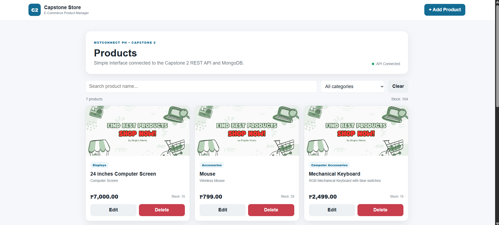
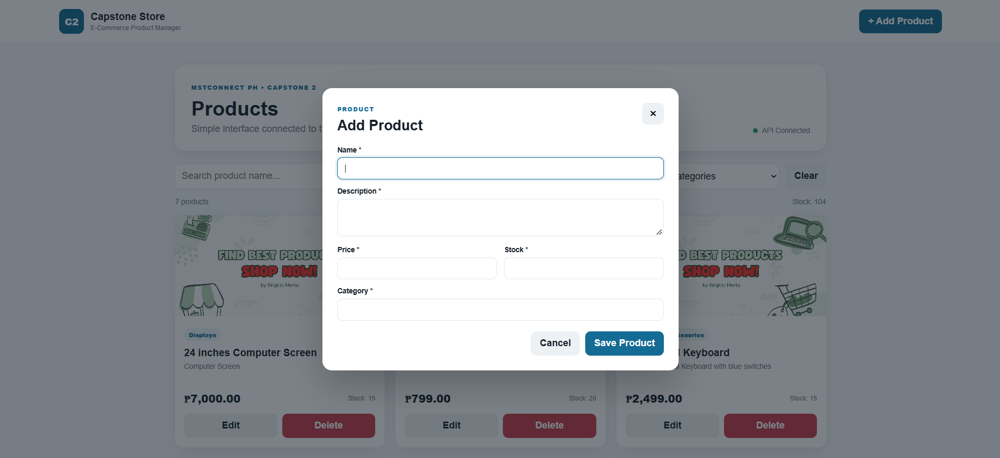
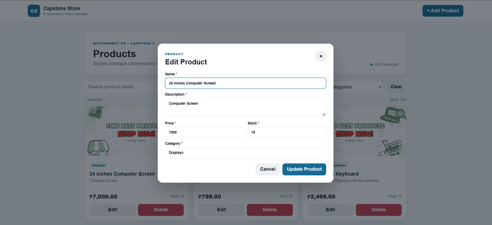
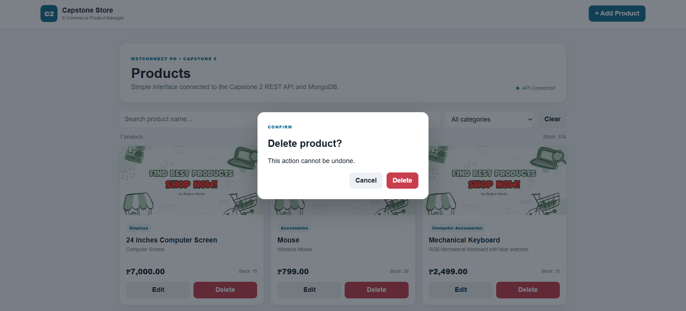

# E-Commerce API with Web Interface

A simple e-commerce product management application built for the **MSTCONNECT PH Full-Stack Web Development Bootcamp – Capstone 2**.

This project combines a **REST API** built with Node.js, Express.js, MongoDB, and Mongoose with a clean and simple browser interface for managing products.

The application supports product CRUD operations, searching, category filtering, and product management through the web interface.

---

## 📸 Interface Preview

### Home

The Home page displays the available products with their name, category, price, stock, and a shared product image.



---

### Add Product

The Add Product interface allows users to create a new product by entering the required product information.



---

### Update Product

The Update Product interface allows users to modify existing product information.



---

### Delete Product

Products can be deleted through the interface with a confirmation step before the deletion is completed.



---

## 🚀 Features

### Product Management

- Add new products
- View all products
- View individual products
- Update existing products
- Delete products
- Display product price and stock
- Shared product image displayed on all product cards

### Search and Filtering

- Search products by name
- Filter products by category
- Case-insensitive product search
- Display all products when no filters are applied

### REST API

The application provides the following REST API endpoints:

| Method | Endpoint | Description |
|---|---|---|
| GET | `/api/products` | Get all products |
| POST | `/api/products` | Create a new product |
| GET | `/api/products/:id` | Get a product by ID |
| PATCH | `/api/products/:id` | Update a product |
| DELETE | `/api/products/:id` | Delete a product |

### Validation and Error Handling

The API handles:

- Missing required fields
- Negative prices
- Negative stock values
- Invalid MongoDB IDs
- Products that do not exist
- MongoDB/Mongoose validation errors
- Server errors

---

## 🛠️ Technologies Used

### Frontend

- HTML5
- CSS3
- JavaScript

### Backend

- Node.js
- Express.js
- REST API

### Database

- MongoDB
- Mongoose

### Development Tools

- Visual Studio Code
- Postman
- Git
- GitHub
- Nodemon

---

## 📁 Project Structure

```text
ecommerce-api-Interface/
│
├── images/
│   ├── Home.png
│   ├── Add.png
│   ├── Update.png
│   └── Delete.png
│
├── public/
│   ├── images/
│   │   └── Cover.jpg
│   │
│   ├── index.html
│   ├── style.css
│   └── script.js
│
├── postman/
│   └── MSTCONNECT-Capstone-2-API.postman_collection.json
│
├── src/
│   ├── config/
│   │   └── db.js
│   │
│   ├── controllers/
│   │   └── productController.js
│   │
│   ├── middleware/
│   │   └── errorHandler.js
│   │
│   ├── models/
│   │   └── Product.js
│   │
│   ├── routes/
│   │   └── productRoutes.js
│   │
│   └── server.js
│
├── .env.example
├── .gitignore
├── package.json
├── package-lock.json
└── README.md

## Installation

1. Clone the repository.
2. Open the project in VS Code.
3. Run `npm install`.
4. Create `.env` in the project root.
5. Add:

```env
PORT=5000
MONGO_URI=your_connection_string
```

6. Run `npm run dev`.
7. Open `http://localhost:5000`.

Never commit the real `.env` file or database credentials.

## Base URL

```text
http://localhost:5000
```

## Search / Filter

```text
GET /api/products?category=Accessories
GET /api/products?search=mouse
GET /api/products?category=Accessories&search=wireless
```

## Example Request Body

```json
{
  "name": "Mechanical Keyboard",
  "description": "RGB keyboard",
  "price": 1850,
  "category": "Accessories",
  "stock": 12
}
```

## Expected Status Codes

- `200 OK` - successful GET, PATCH, or DELETE
- `201 Created` - successful POST
- `400 Bad Request` - missing/invalid input or malformed ID
- `404 Not Found` - product does not exist
- `500 Server Error` - unexpected backend failure

## Postman

Import `postman/MSTCONNECT-Capstone-2-API.postman_collection.json`. Set `baseUrl` to `http://localhost:5000`.

The collection includes CRUD requests plus failure-case requests for missing name, negative price, invalid ID, missing product, and deleting a missing product.

## CRUD Test Flow

```text
POST → copy ID → GET → PATCH → GET → DELETE → GET
```

The final GET should return `404 Not Found`.
